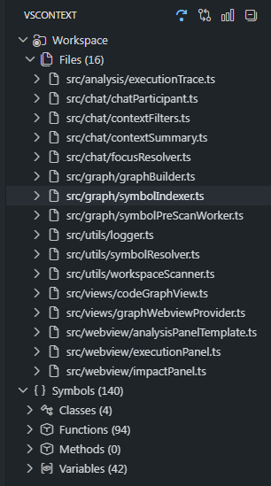
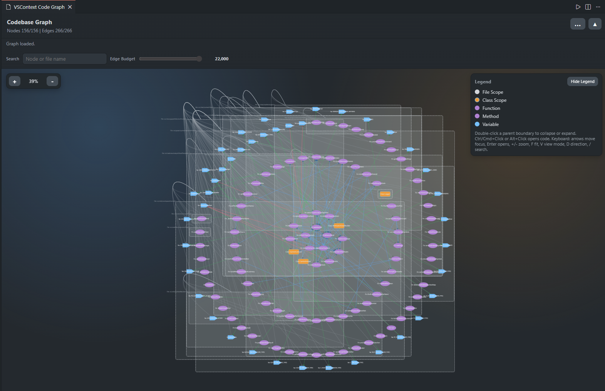

# VSContext


VSContext is a VS Code extension for understanding large codebases with a persistent workspace symbol graph.  
It indexes supported source files, builds symbol relationships, and exposes three practical workflows:

- `Trace Path` for downstream execution traversal.
- `Impact` for upstream blast-radius traversal.
- `View Code Graph` for interactive, repository-level graph exploration.

## Screenshots

### Extension View



### Code Graph View



## What Is New In 0.2.0

- Added a local semantic indexing pipeline with chunked file records and symbol summaries.
- Added native VS Code workspace symbol queries to enrich semantic search results.
- Surfaced semantic matches in chat summaries for architecture context.

## What Is New In 0.1.9

- Added a shared knowledge-model schema for current and future graph entities and relationship kinds.
- Versioned graph cache snapshots with explicit knowledge-model compatibility checks.
- Added graph payload metadata that advertises the active knowledge-model version and catalog.

## What Is New In 0.1.8

- Expanded parser-backed pre-scan language coverage for C#, PHP, Ruby, and Kotlin.
- Expanded C/C++ scan coverage to include `.cc`, `.cxx`, `.hpp`, `.hh`, and `.hxx`.
- Added Swift file scanning via VS Code symbol providers (Tree-sitter pre-scan is not enabled for Swift on Windows).
- Added graph legend toggle with explicit `Hide Legend` and `Show Legend` states.
- Improved Edge Budget guidance and fallback template parity for graph webview controls.

See [CHANGELOG.md](CHANGELOG.md) for full release history.

## Core Capabilities

- Workspace graph indexing with persisted cache hydration on startup.
- Incremental graph updates on save/create/delete with debounced refresh.
- Symbol relationship modeling for:
  - calls
  - implementations
  - variable reads
  - variable writes
- Explorer tree grouped by file and symbol type with quick source navigation.
- Analysis panels with traversal graph and sortable node tables.
- Graph webview with Mind Map and DAG layouts, filtering, keyboard navigation, and progressive load for large graphs.
- Copilot Chat participant `@vscontext` for graph-aware architecture context.

## Commands

- `VSContext: Trace Path`
- `VSContext: Impact`
- `VSContext: View Code Graph`

Available from:

- Command Palette
- VSContext view toolbar
- VSContext symbol context actions

## Quick Start

1. Open a workspace containing supported source files.
2. Open the VSContext activity bar container.
3. Wait for initial indexing or cache hydration.
4. Browse `Workspace > Files` or `Symbols`.
5. Select a symbol and run `Trace Path` or `Impact`.
6. Run `View Code Graph` for architecture-level view.

## Explorer Structure

- `Workspace`
- `Files`:
  - Per-file symbol groups with counts:
    - `Functions`
    - `Methods`
    - `Classes`
    - `Variables` (`Constants`, `Fields`, `Locals`)
- `Symbols`:
  - Global grouped symbols with counts:
    - `Classes`
    - `Functions`
    - `Methods`
    - `Variables` (`Constants`, `Fields`, `Locals`)

Each symbol item opens source directly and supports context actions for trace and impact analysis.

## Analysis Workflows

### Execution Trace

Use when you want downstream behavior from a starting symbol.

- Traverses outgoing relationships (`calls`, `implements`, `reads`, `writes`) with bounded BFS depth.
- Shows interactive traversal graph and a Node Details table.
- Opens source from graph nodes or table rows.

### Impact Analysis

Use when you want upstream impact into a starting symbol.

- Traverses incoming relationships using reverse edges.
- Helps estimate blast radius before edits or refactors.
- Supports filtering and direct source jump.

## Code Graph Workflow

Use when you want workspace-level topology.

- View modes:
  - `Mind Map`
  - `DAG` (with direction toggle)
- Filters and clarity controls:
  - edge type toggles (`calls`, `implements`, `reads`, `writes`, `file-dependency`)
  - variable visibility
  - structural edge visibility
  - smart labels
  - edge budget slider
- Large graph handling:
  - progressively loads symbols
  - includes `Load More` chunking for dense repositories
- Interaction:
  - Ctrl/Cmd+Click or Alt+Click to open source
  - keyboard shortcuts:
    - arrows: focus navigation
    - `Enter`: open node
    - `+` / `-`: zoom
    - `F`: fit
    - `V`: view mode toggle
    - `D`: DAG direction toggle
    - `/`: focus search

## Copilot Chat Integration

VSContext contributes `@vscontext` with commands:

- `/summary`
- `/trace`
- `/impact`
- `/help`

Focus resolution order for `/trace` and `/impact`:

1. explicit `nodeId=<id>` in prompt
2. active editor symbol under cursor
3. last selected VSContext tree symbol
4. inferred symbol from prompt text

If no model is selected, VSContext returns the prepared graph summary directly.

## Supported Files And Scan Scope

### Compatibility

| Area | Support |
| --- | --- |
| VS Code Engine | `^1.95.0` |
| TypeScript / TSX | Supported |
| JavaScript / JSX | Supported |
| Python | Supported |
| Go | Supported |
| Java | Supported |
| Rust | Supported |
| C / C++ / Headers | Supported |
| C# | Supported |
| PHP | Supported |
| Ruby | Supported |
| Kotlin | Supported |
| Swift | Supported (provider-based indexing) |

Scanned source patterns:

- `**/*.ts`
- `**/*.tsx`
- `**/*.js`
- `**/*.jsx`
- `**/*.py`
- `**/*.go`
- `**/*.java`
- `**/*.rs`
- `**/*.cpp`
- `**/*.cc`
- `**/*.cxx`
- `**/*.c`
- `**/*.h`
- `**/*.hpp`
- `**/*.hh`
- `**/*.hxx`
- `**/*.cs`
- `**/*.php`
- `**/*.phtml`
- `**/*.rb`
- `**/*.kt`
- `**/*.kts`
- `**/*.swift`

Excluded folders:

- `node_modules`
- `.git`
- `dist`
- `build`
- `out`
- `coverage`
- `.venv`
- `venv`
- `__pycache__`
- `site-packages`

Discovery is performed with `vscode.workspace.findFiles`.

## Configuration

Configure in `settings.json`:

- `vscontext.maxIndexedFiles` (default: `2000`, minimum: `100`)
  - Maximum number of workspace source files indexed.
- `vscontext.refreshDebounceMs` (default: `300`, minimum: `100`)
  - Debounce interval for incremental refresh after workspace changes.
- `vscontext.workerBatchSize` (default: `75`, range: `50-100`)
  - Batch size for worker pre-scan.
- `vscontext.workerCount` (default: `4`, range: `1-8`)
  - Maximum parallel pre-scan worker threads.
- `vscontext.debugSymbolDetection` (default: `false`)
  - Enables verbose symbol/index diagnostics in VSContext output channel.
- `vscontext.chatContextBudget` (default: `medium`, options: `small`, `medium`, `large`)
  - Controls summary budget for chat context generation.
- `vscontext.chatContextDenylist` (default: `[]`)
  - Additional wildcard path patterns excluded from chat context.
- `vscontext.maxScannedFiles` (deprecated)
  - Backward-compatible alias. Prefer `vscontext.maxIndexedFiles`.

## Architecture Overview

```text
src/
  extension.ts
  analysis/
    executionTrace.ts
    impactAnalysis.ts
  chat/
    chatParticipant.ts
    contextFilters.ts
    contextSummary.ts
    focusResolver.ts
  graph/
    graphBuilder.ts
    symbolIndexer.ts
    symbolPreScanWorker.ts
  tree/
    contextTreeProvider.ts
  views/
    codeGraphView.ts
    graphWebviewProvider.ts
  webview/
    analysisPanelTemplate.ts
    executionPanel.ts
    impactPanel.ts
  utils/
    logger.ts
    symbolResolver.ts
    workspaceScanner.ts
webview/
  graph.html
  graph.css
  graph.js
```

## Development

### Prerequisites

- Node.js 18+
- npm
- VS Code 1.95+

### Build and Run

1. `npm install`
2. `npm run compile`
3. Press `F5` in VS Code to launch Extension Development Host

### Package VSIX

1. Install VSCE if needed: `npm install -g @vscode/vsce`
2. Build extension: `npm run compile`
3. Package: `vsce package`

## Troubleshooting

- Graph is sparse:
  - Increase `vscontext.maxIndexedFiles`.
  - Confirm workspace has supported file types.
- Indexing is slow:
  - Tune `vscontext.workerCount` and `vscontext.workerBatchSize`.
- Expected symbols are missing:
  - Enable `vscontext.debugSymbolDetection`.
  - Check VSContext output channel diagnostics.
- Graph is too dense:
  - Use edge filters, variable/structural toggles, search, and edge budget.

## License

MIT
